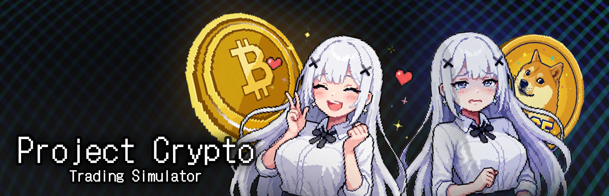

# Project Crypto: Trading Simulator

  

> **"회사에서 코인 해도 안 잘리는 유일한 방법!"**  
> 90년대 레트로 픽셀 미학과 현대 가상화폐 시장의 변동성을 결합한 금융 서바이벌 시뮬레이션  
> **C# & Unity 기반 1인 개발 프로젝트** (WebGL 피드백 테스트 및 Steam 데모 출시 완료)

---

## Game Synopsis & Overview

당신은 방금 코인 전문 투자 회사에 입사한 신입 트레이더입니다. 하지만 회사는 처음부터 거액을 맡기지 않습니다. 퇴근 후 아르바이트로 초기 자본을 모으고, 시장의 파도를 타며 자산을 불려 승진을 향해 나아가세요. 사내 정치보다 무서운 시장의 냉혹함 속에서, 당신은 과연 전설적인 트레이더가 될 수 있을까요?

* **게임 타이틀**: Project Crypto Trading Simulator
* **장르**: 레트로 픽셀 트레이딩 시뮬레이션 / 금융 서바이벌
* **플랫폼**: WebGL (`carrotmango.xyz` 피드백 수집용) / PC (Steam 데모 배포)
* **개발 환경**: Unity (6000.2.7f2), C#
* **게임 목표**: 초기 시드머니로 시작해 실시간 시장 흐름을 분석하고, 자산 증식 및 회사 자본 납입을 통해 레버리지 및 부동산 등 특별한 권한을 해금하며 최고의 부를 달성.

> Demo 버전이므로 정식 버전의 일부 콘텐츠 이용이 제한되어 있습니다.

---

## 게임의 특징

* **밑바닥부터 시작하는 시드머니**: 퇴근 후 다양한 아르바이트를 통해 초기 투자 자금을 마련하세요. 이 땀 묻은 돈이 거대한 자산의 씨앗이 됩니다.
* **리얼한 트레이딩 경험**: 비트코인부터 다양한 알트코인까지, 실시간 차트를 분석하고 매수/매도 타이밍을 잡으세요.
* **현물, 선물, 그리고 부동산**: 처음엔 현물 거래로 시작하지만, 승진할수록 고수익 고위험의 '선물 거래'와 안정적인 자산의 끝판왕 '부동산' 앱이 해금됩니다.
* **승진과 성장**: 수익을 회사에 납입하여 당신의 가치를 증명하세요. 인턴에서 시작해 더 높은 직급으로 승진할수록 고성능 투자 도구와 특별한 권한이 해제됩니다.
* **정보가 곧 돈이다**: 가짜 뉴스와 진실이 섞인 'Xbird 피드'를 분석하세요. 남들보다 한발 빠른 정보 습득만이 무자비한 시장에서 살아남을 유일한 방법입니다.
* **역량 강화**: 번 돈을 자신의 스킬에 투자하세요. 급여 효율을 높이고 '급여 크리티컬' 같은 패시브 스킬을 강화하여 매매 외적으로도 수익을 극대화할 수 있습니다.

---

## 핵심 시스템 디자인

### ① 동적 가격 결정 엔진 (Price Engine)
* **Market Phase 시스템**: 전역 시장 상태를 `MegaBull`부터 `MegaBear`까지 **11단계**로 세분화하여 상승/하락 확률(`directionBias`) 및 변동 폭(`baseMagnitude`)을 동적으로 적용.
* **자산별 변동성 (Volatility Level)**: 메이저 코인부터 밈(Meme) 코인까지 1~5단계 변동성 레벨을 부여해 하이리스크-하이리턴 구조 설계.
* **스테이블 코인 디페깅**: USDT, USDC 등에 실제 환율 데이터 연동 및 미세 노이즈(`depeggingNoise`) 산출 로직 구현.
* **실매매 알고리즘**: 데이터 부하 방지를 위한 최소 주문금액(5,000원) 제약, 수수료 산입 평단가 실시간 UI 동기화, 차트 내 매수(B)/매도(S) 실시간 마킹.

### ② 하이리스크 파생상품 엔진 (Perpetual & Leverage)
* **다중 증거금 모드**: 전재산을 담보로 청산가를 재계산하는 **교차(Cross)** 및 투입 증거금 내 리스크를 제한하는 **격리(Isolate)** 마진 지원.
* **직급 기반 레버리지 해금**: 유저 직급에 따라 최대 레버리지를 차등 제한(사원 5x ~ 차장 20x ~ 최상위 100x).
* **실시간 Net PnL & 강제 청산**: 예상 수수료를 즉시 차감한 실질 수익률 노출 및 청산가 도달 시 긴급 통지 연출.

### ③ 실시간 이벤트 & 정보 (Event Orchestration)
* **NewsPanel & 찌라시 (Xbird Feed)**: 시나리오 및 조건에 따라 상폐/펌핑/뉴스 포스트를 자동 발행하며, 확률 기반 여론 생성 및 쿨타임 시스템 적용.
* **Global Notification & SMS**: 급여 입금, 청산 알림, 주요 뉴스를 SMS 알림 형태로 발송해 몰입감 극대화.

### ④ 금융 인프라 및 고정 수익 (Banking & Real Estate)
* **은행/대출 (Loan System)**: 신용 등급 기반 대출 한도/이자율 설정 및 매일 자정 복리 이자 차감.
* **부동산 매매**: 원룸, 빌라, 아파트, 빌딩 매입을 통해 하락장에서도 견디는 영구적 임대 수익(Cash Flow) 확보.
* **일일 정산 엔진**: 매일 자정 급여, 임대 수익, 대출 이자를 통합 계산해 일일 재무 리포트 제공.

### ⑤ 외출, 아르바이트 & Dapp 시스템
* **아르바이트 미니게임**: 물류 분류 미니게임(빠른 지원 / 심화 지원)을 통해 성과 기반 초기 시드머니 확보.
* **다중 Dapp 지원**: 일반 코인 거래소(BullBit) 외 DEX(밈코인), NFT 거래소, 크립토 지갑, 정보 수집용 술집 구현.

---

## Graphics & Art Style

* **비주얼 컨셉**: 90년대 PC-98 플랫폼 특유의 8-bit / 16-bit 레트로 픽셀 아트 지향.
* **UI/UX Design**: 레트로 아이콘과 텍스트를 유지하면서 실시간 차트 및 데이터 패널은 현대적 가독성을 확보.

---

## Development Roadmap & Milestones (2026)

* **Phase 1 (2026.02)**: 핵심 루프 고도화, 선물 거래 및 부동산 시스템 최종 밸런싱
* **Phase 2 (2026.03 ~ 2026.04)**: Steam 상점 페이지 및 홍보용 트레일러/데모 등록, WebGL 유저 피드백 수집
* **Phase 3 (~2027)**: DEX, NFT 거래소 등 엔드 콘텐츠 추가, 사운드/그래픽 폴리싱 후 Steam 정식 출시
